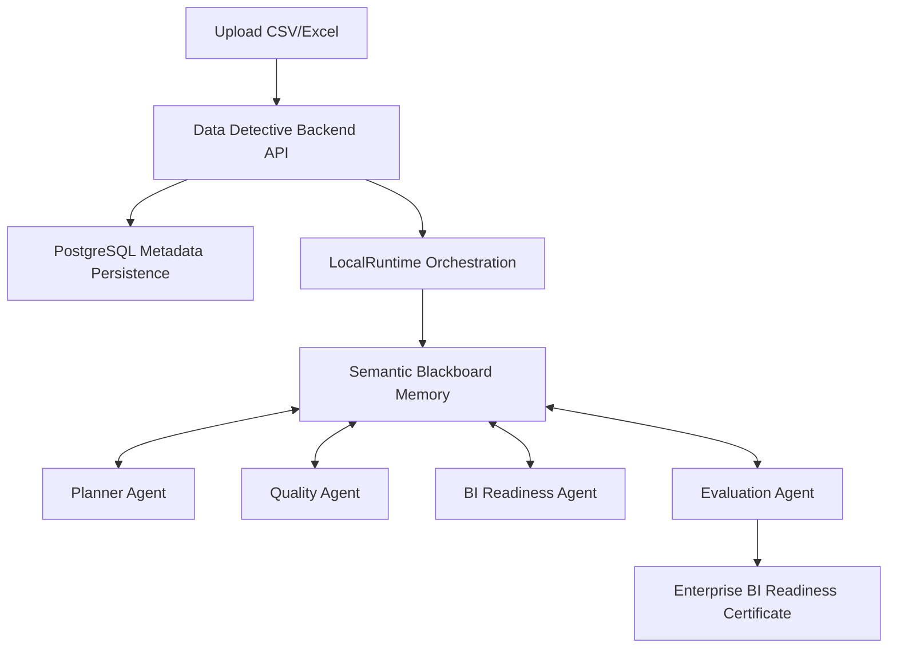

# Data Detective

[](https://github.com/GIT-KrishSandhu/Data-Detective-Agent)
[](https://www.python.org/)
[](https://nextjs.org/)
[]()
[]()

> **Enterprise AI agents that audit datasets before they reach Power BI.**

Data Detective is a **Semantic Blackboard Multi-Agent Enterprise Data Auditing Platform** designed to validate, profile, and certify raw corporate datasets before ingestion into Power BI reports and Microsoft Fabric semantic models.

---

## 🧠 Architecture Overview

### Semantic Blackboard Multi-Agent System
Rather than relying on generic chat bubbles or fragile prompt chains, Data Detective uses a decoupled **Semantic Blackboard Architecture**. A coordinator runtime drives sequential specialist agents, which read from and write back to a shared, version-controlled state.



### Agent Routing Flow
Every run executes a deterministic pipeline that ensures data structure safety, quality validation, schema mapping, and runtime verification before producing a certificate.


---

## 🚀 Key Features

* **Power BI Readiness Engine**: Validates column cardinality, PK/FK links, data uniformity, date continuity, and aggregates.
* **Statistics as Semantic Entities**: Column distributions, primary key candidates, and metrics are modeled as structured entities (`DistributionEntity`, `BusinessMetricEntity`, `AggregationRecommendationEntity`) rather than unstructured dictionary lists.
* **Multi-Agent Execution Timeline**: Displays real-time, step-by-step progress of agent invocations, tool run durations, and blackboard state versioning.
* **Blackboard Inspector**: Live inspectable developer debugger displaying all compiled semantic relationships, memories, and entities.
* **Enterprise BI Readiness Certificate**: executive widget certifying datasets with weighted scores, overall statuses (PASS, WARNING, FAIL), and checked execution trace checkpoints.

---

## 🛡️ Core Evaluation Methodology

The final `EvaluationAgent` runs an automated verification check over the blackboard state, calculating an overall quality index based on five deterministic dimensions:

| Dimension | Weight | Description |
| :--- | :---: | :--- |
| **Evidence Completeness** | 20% | Ratio of columns successfully profiled into semantic distributions. |
| **Determinism** | 20% | Ensures 100% of reasoning checks map directly to code checks. |
| **Recommendation Coverage** | 20% | Percentage of identified quality issues with accompanying resolution advice. |
| **Agent Agreement** | 20% | Consistency between planner expectations and actual check discoveries. |
| **Trace Completeness** | 20% | Ensures every log step contains a valid parent trace ID and completed status. |

---

## 🔌 Microsoft Fabric & Power BI Alignment

Data Detective fits natively into Microsoft-centric data engineering and analytics pipelines:
1. **Star Schema Reasoning**: The BI Readiness Agent infers dimension and fact tables, identifying where standard calendars (e.g., date dimensions) are required.
2. **Aggregation Safety**: Automatically recommends default aggregation settings (e.g., Sum vs Median) for columns based on statistical skewness boundaries to prevent skewed dashboards.
3. **Foundry-Compatible Adapter**: Exposes provider-agnostic adapter hooks (`FoundryAdapterInterface`) prepared for direct migration to Azure AI Foundry agent hosting.

---

## 🗺️ Project Roadmap

```
Phase 6: BI Readiness Agent (renamed from Statistics Agent)   ██████████ 100% (Complete)
Phase 7: Executive Report Agent                                ██████████ 0%   (Pending)
Phase 8: Azure Ingestion Integration                           ██████████ 0%   (Pending)
Phase 9: UI Polish & Submission                                ██████████ 0%   (Pending)
```

---

## 🛠️ Tech Stack & Directory Structure

* **Frontend**: Next.js 16 (App Router), TypeScript, Tailwind CSS, Lucide Icons, Shadcn/ui
* **Backend**: FastAPI, Python 3.12, SQLAlchemy (Async Asyncpg)
* **Agent Engine**: LangGraph, LangChain
* **Database**: PostgreSQL

### Directory Map
* [backend/agents/bi_readiness/](file:///c:/Users/krish/Desktop/AI%20Skills%20Fest/Data-Detective-Agent/backend/agents/bi_readiness/): Coordinates profile tools and generates Power BI Readiness recommendations.
* [backend/tools/statistics/](file:///c:/Users/krish/Desktop/AI%20Skills%20Fest/Data-Detective-Agent/backend/tools/statistics/): Deterministic statistics tools (`metric_relationship_tool.py`, `outlier_summary_tool.py`).
* [backend/services/microsoft/semantic_entities/](file:///c:/Users/krish/Desktop/AI%20Skills%20Fest/Data-Detective-Agent/backend/services/microsoft/semantic_entities/): Pydantic specifications for blackboard semantic models.
* [frontend/app/explore/page.tsx](file:///c:/Users/krish/Desktop/AI%20Skills%20Fest/Data-Detective-Agent/frontend/app/explore/page.tsx): Main explorer interface with the Readiness Dashboard, Activity Log, and Blackboard debugger.
* [frontend/components/workflow-viewer.tsx](file:///c:/Users/krish/Desktop/AI%20Skills%20Fest/Data-Detective-Agent/frontend/components/workflow-viewer.tsx): Renders the animated multi-agent network log steps.