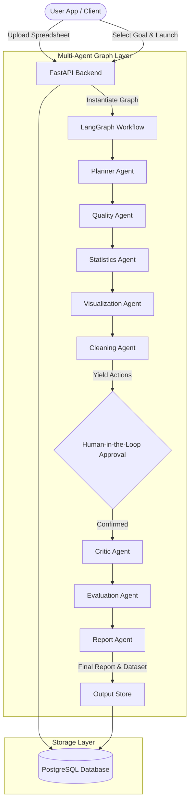

# Data Detective Agent - System Architecture

This document outlines the high-level architecture of the **Data Detective Agent** platform.

## Architectural Design Patterns

### 1. Blackboard Architecture Pattern
All agents in the league write to and read from a shared, coordinate blackboard state (`AgentState`). This promotes loose coupling:
- Agents do not need to know the specific implementation details of other agents.
- Each agent performs its specialized operations and appends findings to the shared state.
- Intermediate results (e.g., statistical profiles) are stored transparently for other agents to read.

### 2. Provider-Agnostic LLM Binding
The `BaseAgent` class is designed to accept generic LangChain `BaseChatModel` interfaces. This makes the platform vendor-neutral, supporting local models (Ollama, Llama), standard endpoints (OpenAI GPT-4o), and cloud services (Azure OpenAI) via unified environment configurations.

### 3. Human-in-the-Loop (HITL) Gatekeeper
To ensure data safety, dataset modifications are never executed autonomously. The `CleaningAgent` outputs a list of proposed modifications with python preview statements. The graph execution yields control back to the user to confirm/reject these changes, saving the selections to the state before completing the remaining stages.

### 4. Telemetry and Logging
The system integrates structured logging at every step using `TelemetryLogger`. We track:
- Node entry and exit events.
- Response latencies.
- Token metrics per agent call.
- Database access and execution times for verification audits.
