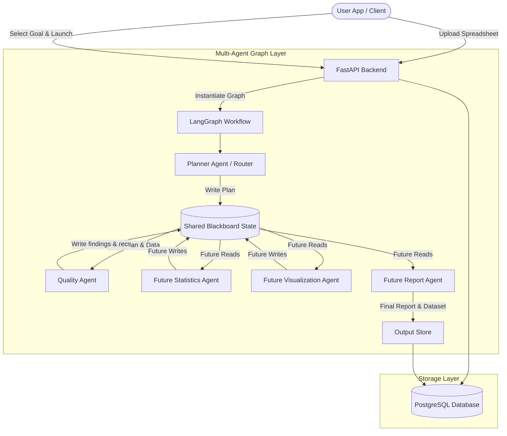

# Data Detective Agent - System Architecture

This document outlines the high-level architecture of the **Data Detective Agent** platform.

## Architectural Design Patterns

### 1. Blackboard Architecture Pattern
All agents in the system read from and write to a centralized, shared blackboard state (`AgentState`). Rather than communicating via direct peer-to-peer messaging, workers operate asynchronously and coordinate exclusively through this shared state.

**Why Workers Communicate Through Shared State Instead of Direct Messaging:**
- **Decoupling and Scalability ($O(1)$ vs $O(N^2)$ Complexity):** In a direct messaging system, adding a new agent requires updating the communication interfaces and message parsing logic of all other agents it interacts with, leading to high architectural coupling. With the Blackboard pattern, any agent can be added, updated, or removed independently as long as it adheres to the blackboard's data contract (`AgentState` / `AgentResult`).
- **Observability and Auditability:** The blackboard holds the complete, historical state of the execution run (the "blackboard memory"). This acts as a single source of truth, making it trivial to inspect intermediate outputs, track token consumption, and build real-time visual progress logs for the end user.
- **State-Based Coordination:** The orchestrator (LangGraph) can easily manage flow transitions, criteria evaluations, and human-in-the-loop approvals simply by reading flags on the blackboard (e.g. checking if user-approved cleaning actions are present).

### 2. Provider-Agnostic LLM Binding
The `BaseAgent` class is designed to accept generic LangChain `BaseChatModel` interfaces. This makes the platform vendor-neutral, supporting local models (Ollama, Llama), standard endpoints (OpenAI GPT-4o), and cloud services (Azure OpenAI) via unified environment configurations.

### 3. Human-in-the-Loop (HITL) Gatekeeper
To ensure data safety, dataset modifications are never executed autonomously. The `CleaningAgent` outputs a list of proposed modifications with python preview statements. The graph execution yields control back to the user to confirm/reject these changes, saving the selections to the state before completing the remaining stages.

### 4. Telemetry and Logging
The system integrates structured logging at every step using `TelemetryLogger` and `agent_execution_log` updates. We track:
- Node entry and exit events.
- Individual tool runtimes (e.g. Missing Value Tool, Duplicate Detector).
- Response latencies and token metrics.
- Database access and execution times for verification audits.
