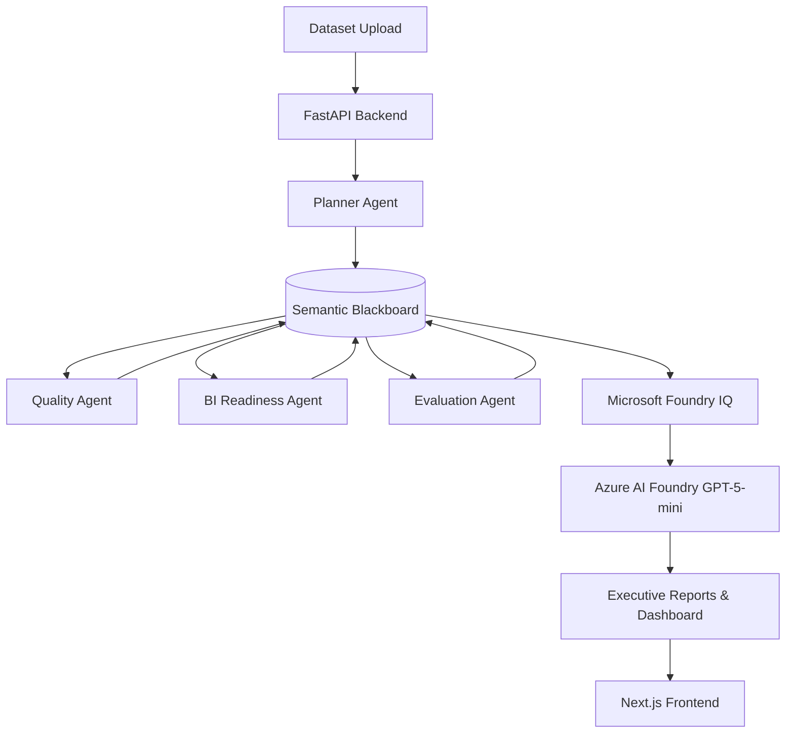

# Data Detective Agent – System Architecture

> **Data Detective is a Reasoning Agent for Business Intelligence.**
>
> The platform does **not** rely on LLM reasoning to analyze datasets. Instead, deterministic Python agents perform evidence-based validation, publish findings to a shared Semantic Blackboard, retrieve enterprise best practices through Microsoft Foundry IQ, and finally invoke Azure AI Foundry GPT-5-mini exclusively for executive language generation.

---

# High Level Architecture



---

# Execution Pipeline

```
CSV Upload
      │
      ▼
Planner Agent
      │
      ▼
Quality Agent
      │
      ▼
BI Readiness Agent
      │
      ▼
Evaluation Agent
      │
      ▼
Semantic Blackboard
      │
      ▼
Microsoft Foundry IQ Grounding
      │
      ▼
Azure GPT-5-mini
      │
      ▼
Executive Business Insights
```

---

# Core Design Principles

## 1. Deterministic Reasoning

Every analytical conclusion is generated through Python code, Pandas operations, statistical profiling, and schema validation.

Examples include:

* Missing value detection
* Duplicate identification
* Mixed datatype analysis
* Identifier discovery
* Cardinality analysis
* Distribution profiling
* Outlier detection
* Schema relationship inspection
* BI readiness evaluation

No analytical decision is delegated to a language model.

---

## 2. Semantic Blackboard Architecture

All reasoning agents communicate exclusively through a shared Semantic Blackboard.

Each agent:

* reads validated entities
* contributes new evidence
* publishes structured findings
* updates blackboard version history

Advantages include:

* deterministic execution
* agent independence
* complete observability
* reproducible reasoning
* explainable audit trails

instead of opaque prompt chains.

---

## 3. Microsoft Foundry IQ Grounding

Before executive summaries are generated, the platform retrieves relevant enterprise documentation from a dedicated Microsoft Foundry IQ knowledge base.

The grounding corpus includes:

* Power BI Modeling Guide
* BI Readiness Framework
* Enterprise Governance Policies
* Data Quality Standards
* Semantic Model Best Practices
* Business Intelligence Casebooks

Retrieved passages are supplied as grounding context only.

Foundry IQ enhances factual consistency while analytical conclusions remain deterministic.

---

## 4. Azure AI Foundry Language Layer

Azure AI Foundry GPT-5-mini is responsible only for:

* executive summaries
* management explanations
* certificate wording
* markdown export generation

The model never computes scores, validates datasets, or performs statistical reasoning.

This architecture significantly reduces hallucination risk while improving communication quality.

---

# Runtime Transparency

The application exposes its runtime directly to the user.

```
Provider:
Azure AI Foundry

Language Layer:
gpt-5-mini

Reasoning Engine:
Semantic Blackboard

Knowledge Grounding:
Microsoft Foundry IQ

Execution:
Deterministic
```

Every execution is fully observable through live telemetry streams and blackboard updates.

---

# Agent Responsibilities

### Planner Agent

* establishes analytical objective
* schedules workflow
* initializes Semantic Blackboard

### Quality Agent

* performs structural validation
* executes deterministic quality tools
* publishes findings

### BI Readiness Agent

* evaluates Power BI compatibility
* validates semantic modeling requirements
* computes readiness indicators

### Evaluation Agent

* aggregates evidence
* validates completeness
* prepares executive outputs

---

# Technology Stack

## Frontend

* Next.js
* React
* TypeScript
* Tailwind CSS

## Backend

* FastAPI
* LangGraph
* Pandas
* PostgreSQL

## AI Services

* Azure AI Foundry GPT-5-mini
* Microsoft Foundry IQ
* Azure OpenAI

---

# Design Philosophy

Traditional AI analytics systems send raw datasets directly to an LLM and rely on generative reasoning.

Data Detective follows a different philosophy:

> **Reason first. Retrieve enterprise knowledge second. Generate language last.**

This separation between deterministic analytics, enterprise grounding, and executive communication produces transparent, explainable, and enterprise-ready Business Intelligence insights.
